# **My Cookbook**

## **Introduction**

My Cookbook is an online cookbook that is aimed at the foodie community and those who love to make home-made food. 

The site is targeted at anyone who enjoys cooking, with easy to follow recipes, aimed for various cooking and baking skill levels. The website hopes to accomplish a full online cookbook with various different types of cusines that people may like to eat and try.

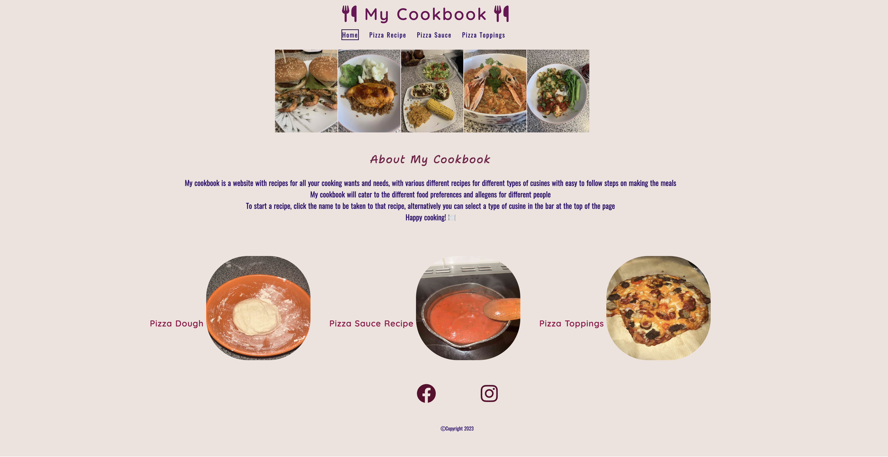

## **Table of Contents**

<a href="#features">Features</a>

<ul>

<a href="#existing-features">Existing Features</a>

<li> Navigation Bar </li>
<li> Homepage Image Bar </li>
<li> About My Cookbook</li>
<li> Recipe Images and Links </li>
<li> The Footer </li>
<li> Introduction to Page </li>
<li> Instructions/Steps </li>

<a href="#features-left-to-implement">Features Left to Implement</a>

</ul>

<a href= "#testing">Testing</a>

<ul>

<a href="#validator-testing">Validator Testing</a>

<li> HTML </li>
<li> CSS </li>

<a href="#lighthouse">Lighthouse</a>

<a href="#unfixed-bugs">Unfixed Bugs</a>

</ul>

<a href="#deployment">Deployment</a>

<a href="#credits">Credits</a>

 

## **Features**

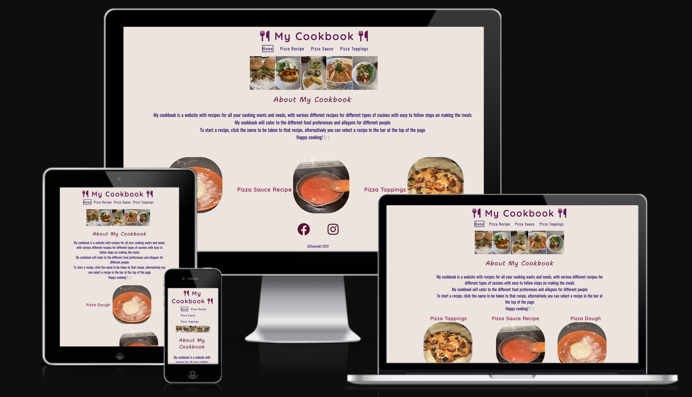

In this section I will discuss the various features that I implemented in the design for the My Cookbook website, including future features that I would like ti implement and design for the website.

### ***Existing Features***

 

#### Navigation Bar
* The navigation bar is featured on all four pages of the website, it includes links to the Home page, Pizza Recipe page, Pizza Sauce page and Pizza Toppings page - this is identical on each page to allow for easy navigation. The logo is also a link which will take the user directly back to the home page.
* The navigation bar allows users to easily go between each of the pages without having to press the back button to switch between pages.
* The page that is currently active also has a sqaure border around it so that the user can see which page they are on.

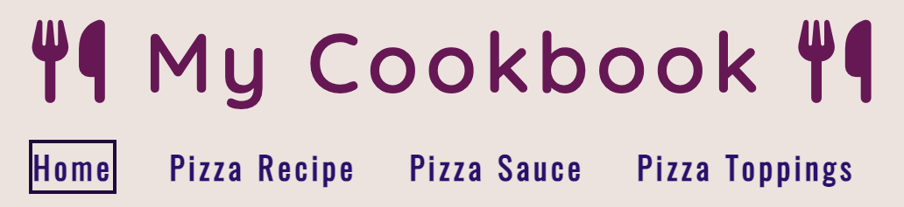

 

#### Homepage Image Bar
* The image bar is featured on the home page for the website, and has five different photos of home-made foods, this was a feature that I thought fitted in well with the concept of a cookbook, as they are all home-made recipes that I had made myself in the past.
* Hopefully this sort of feature will inspire others to what they can achieve and accomplish by cooking home-made meals.

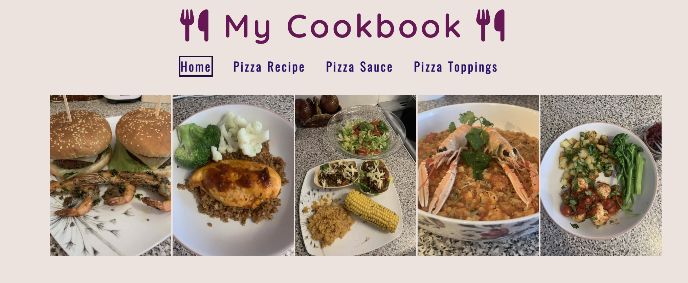

 

#### About My Cookbook
* This section was added as an introduction to the website, allowing users to understand the purpose behind it and how to use some of the basic features of the page, as well as the 'Happy Cooking &#127869;' saying, which is on all the pages, similar to a motto.

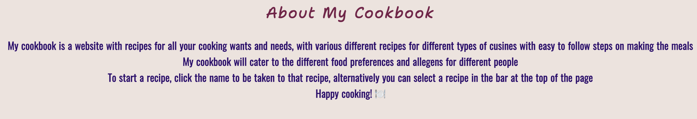

 

#### Recipe Images and Links
* This section on only on the homepage, and acts as a secondary link to each of the recipe pages for the website, with a corresponding image. By clicking the text, the user will also be taken to that particular recipe.

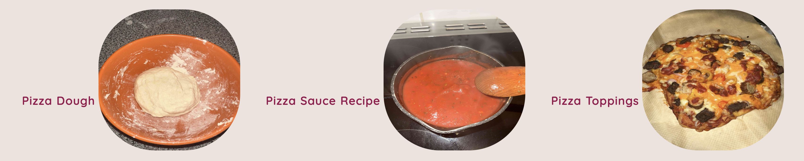

 

#### The Footer
* The footer section is included across all four pages of the website and it links to the relevant social media pages for My Cookbook - there is currently only 2 social media links. When the icon is clicked, the page will open in a new tab, allowing for easy navigation for the user, so they don't lose the page that they are on.
* The footer with the links to social media adds value, as it allows users to keep connected through different forms of social media.
* I did add a copyright feature, as this was something I usually see across majority of websites, and thought it would be clever practice to include this (also all the media included on the page is all my personal images and videos).

 

#### Introduction to Page
* Each page has an introduction to what the page is about and what it will teach them to do, as well as include text links back to the other pages which relate to the current page that they are on. I thought this feature is useful for the users to understand what they will be learning in that particular page that they are on.
* Each of these pages also include the motto from the homeepage: 'Happy Cooking &#127869;'.
* Each page also includes a message that lets users know that they can tick off each step once completed.

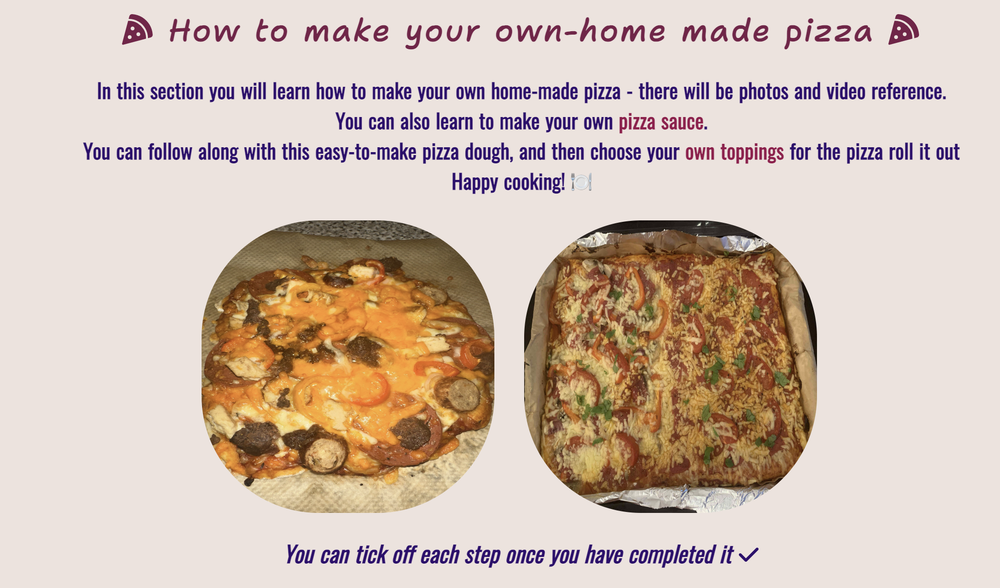
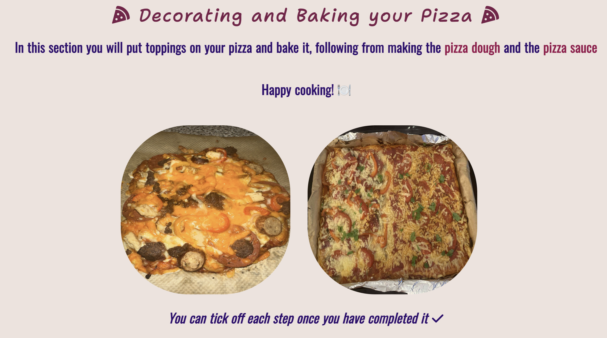
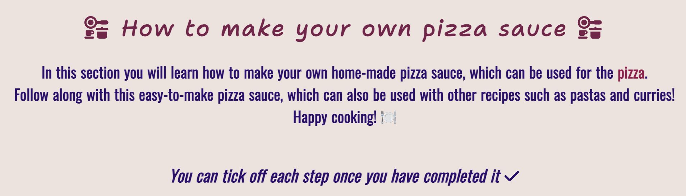

 

#### Instructions/Steps
* Each page features an unordered list for the equipment and ingredients needed for each recipe, with the checkbox feature for users to tick off the step that they have done. However the page for Pizza Dough does include an extra section called 'Before We Begin" which lets users know some important steps that they should follow before making the dough. The steps for making the dough has been put into an ordered list, also containing the checkbox feature.
* Each section has been numbered to let users know the order of the steps, this was not done in an ordered list though as this was a last minute decision to see how it would look, and it looked better set out this way, rather than in a list function.
* Each section also includes photos for the steps, and the page for Pizza Dough also includes two playable videos for users to interact with, which users can control themselves, and is automatically muted. The videos show some stages for the dough which were harder to describe with text or photos.

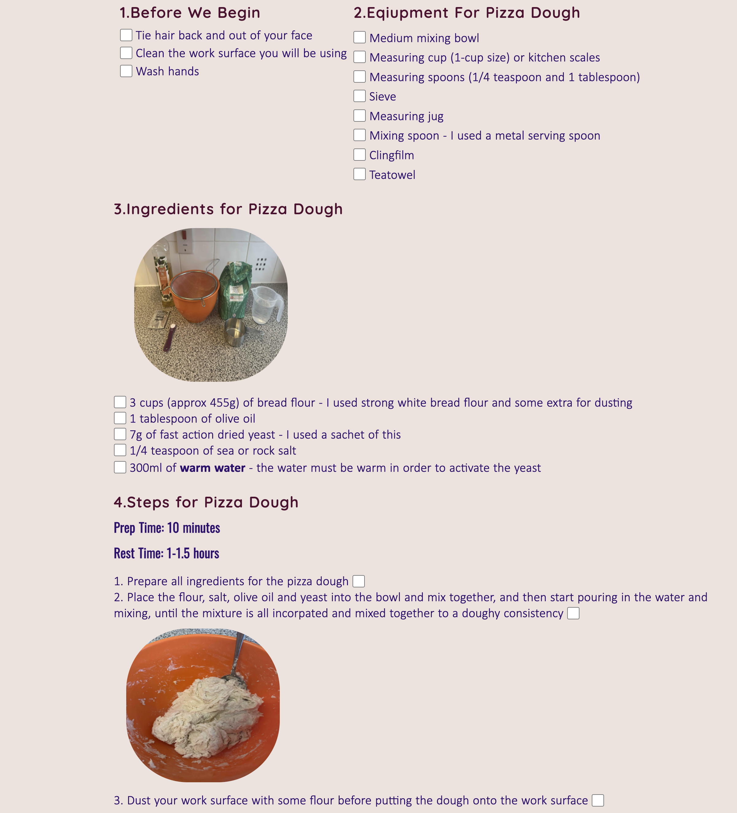
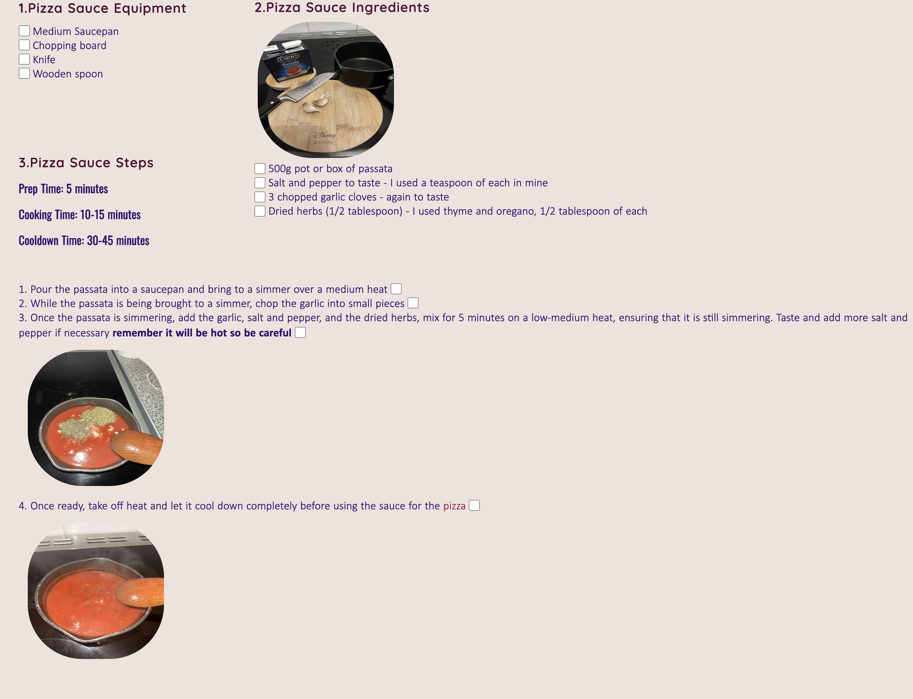
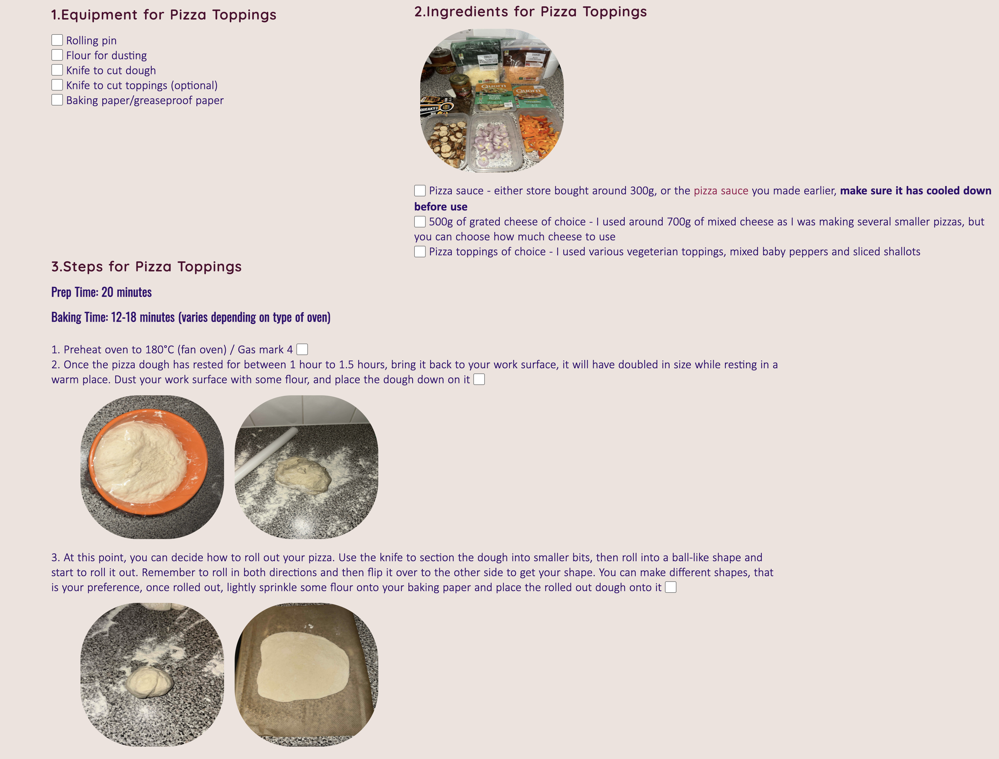

 

### ***Features Left to Implement***