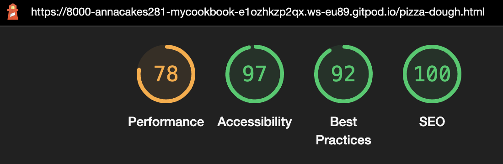

# **My Cookbook**

## **Introduction**

My Cookbook is an online cookbook that is aimed at the foodie community and those who love to make home-made food. 

The site is targeted at anyone who enjoys cooking, with easy to follow recipes, aimed for various cooking and baking skill levels. The website hopes to accomplish a full online cookbook with various different types of cusines that people may like to eat and try.

## **Table of Contents**

<a href="#features">Features</a>

<ul>

<a href="#existing-features">Existing Features</a>

<li> Navigation Bar </li>
<li> Homepage Image Bar </li>
<li> About My Cookbook</li>
<li> Recipe Images and Links </li>
<li> The Footer </li>
<li> Introduction to Page </li>
<li> Instructions/Steps </li>

<a href="#features-left-to-implement">Features Left to Implement</a>

<li> All Pages </li>
<li> Homepage </li>
<li> Footer</li>
<li> Other </li>
</ul>

<a href= "#testing">Testing</a>

<ul>

<a href="#validator-testing">Validator Testing</a>

<li> HTML </li>
<li> CSS </li>

<a href="#unfixed-bugs">Unfixed Bugs</a>

<li> HTML </li>

<a href="#lighthouse">Lighthouse</a>

<li> Homepage Results </li>
<li> Pizza Dough Results </li>
<li> Pizza Sauce Results </li>
<li> Pizza Toppings Results </li>

<a href="#responsiveness">Responsiveness</a>

<li> Desktop </li>
<li> Laptop </li>
<li> Tablet </li>
<li> Mobile </li>
<li> Future Implementations </li>
</ul>

<a href="#deployment">Deployment</a>

<ul>
<li> GitHub Pages</li>
</ul>

<a href="#credits">Credits</a>

<ul>
<li> Content </li>
</ul>

 

## **Features**
In this section I will discuss the various features that I implemented in the design for the My Cookbook website, including future features that I would like to implement and design for the website.

### ***Existing Features***

 

#### Navigation Bar
* The navigation bar is featured on all four pages of the website, it includes links to the Home page, Pizza Recipe page, Pizza Sauce page and Pizza Toppings page - this is identical on each page to allow for easy navigation. The logo is also a link which will take the user directly back to the home page.
* The navigation bar allows users to easily go between each of the pages without having to press the back button to switch between pages.
* The page that is currently active also has a sqaure border around it so that the user can see which page they are on.

 

#### Homepage Image Bar
* The image bar is featured on the home page for the website, and has five different photos of home-made meals, this was a feature that I thought fitted in well with the concept of a cookbook, as they are all home-made recipes that I had made myself in the past.
* Hopefully this sort of feature will inspire others to what they can achieve and accomplish by cooking home-made meals.

 

#### About My Cookbook
* This section was added as an introduction to the website, allowing users to understand the purpose behind it and how to use some of the basic features of the page, as well as the 'Happy Cooking &#127869;' saying, which is on all the pages, similar to a motto.

 

#### Recipe Images and Links
* This section on only on the homepage, and acts as a secondary link to each of the recipe pages for the website, with a corresponding image. By clicking the text, the user will also be taken to that particular recipe.

 

#### The Footer
* The footer section is included across all four pages of the website and it links to the relevant social media pages for My Cookbook - there is currently only 2 social media links. When the icon is clicked, the page will open in a new tab, allowing for easy navigation for the user, so they don't lose the page that they are on.
* The footer with the links to social media adds value, as it allows users to keep connected through different forms of social media.
* I did add a copyright feature, as this was something I usually see across majority of websites, and thought it would be clever practice to include this (also all the media included on the page is all my personal images and videos).

 

#### Introduction to Page
* Each page has an introduction to what the page is about and what it will teach them to do, as well as include text links back to the other pages which relate to the current page that they are on. I thought this feature is useful for the users to understand what they will be learning in that particular page that they are on.
* Each of these pages also include the motto from the homeepage: 'Happy Cooking &#127869;'.
* Each page also includes a message that lets users know that they can tick off each step once completed.

 

#### Instructions/Steps
* Each page features an unordered list for the equipment and ingredients needed for each recipe, with the checkbox feature for users to tick off the step that they have done. However the page for Pizza Dough does include an extra section called 'Before We Begin" which lets users know some important steps that they should follow before making the dough. The steps for making the dough has been put into an ordered list, also containing the checkbox feature.
* Each section has been numbered to let users know the order of the steps, this was not done in an ordered list though as this was a last minute decision to see how it would look, and it looked better set out this way, rather than in a list function.
* Each section also includes photos for the steps, and the page for Pizza Dough also includes two playable videos for users to interact with, which users can control themselves, and is automatically muted. The videos show some stages for the dough which were harder to describe with text or photos.
* Each video and image contains an 'aria-label' for accessability for users.

 

### ***Features Left to Implement***

There are some features that I would like to eventually change and implement for the website in the future.

 

#### All Pages
* Changing the nav bar from 'recipe names' to 'types of cusine'.
* Add a sidebar for users to choose from the selection of recipes to choose from, adding them into different types of categories.
* Adding a search bar to look for recipes.
* Add related recipe ideas on the sides of the page and best paired with.

#### Homepage
* Add a background photo rather than a background colour.

#### Footer
* Add more social media links, and one day actually create real pages for each of these social media links for users to go on.

#### Other
* A signup/login page for users to be able to save and bookmark their favourite recipies.
* A comment section for users to give their feedback and input for other users for what they may have did differenly and any suggestions.

## **Testing**

In this section I will discuss the results from using the HTML and CSS validator, any unfixed bugs that occured within the code, and the Lighthouse results using the dev tools.

I will also mention the responsiveness for four different types of viewports, that were taken from the [Am I Responsive](https://ui.dev/amiresponsive?) website for desktop. laptop, tablet and mobile.

### ***Validator Testing***

To test my code for bugs, I used the [W3C HTML Validator](https://validator.w3.org/#validate_by_input) for my HTML and the [W3C CSS Validator](https://jigsaw.w3.org/css-validator/#validate_by_input) for my CSS.

#### HTML Results
* There were no errors in the HTML code for the homepage when using the offical validator.

 

* There were however **7 errors** showing for the Pizza Dough page, this was due to having images/videos, and a 'br' contained within list elements (more details about this bug can be found in the Unfixed Bugs section).

 

* There were **2 errors** showing for the Pizza Sauce page, this was due to having images contained within list elements (more details about this bug can be found in the Unfixed Bugs section).

 

* There were **9 errors** showing for the Pizza Toppings page, this was due to having images contained within list elements (more details about this bug can be found in the Unfixed Bugs section).

 

#### CSS Results
* There were no errors in the CSS code when using the offical validator.

 

### ***Unfixed Bugs***
#### HTML
* There were **18 errors** in total that were found on the HTML validator due to the images being part of the list element. These were not fixed as by the time I had run the validator and realised that these errors had appeared, I was already getting too close to the deadline date and needed to work on implementing the other features. Although these show as errors, they have not seemed to effect the page in any way from what I could see on my end when looking at the live website. In the future I would like to find a work around to fix this so that there will not be any errors.

 

### ***Lighthouse***
In this section I will discuss the results from the lighthouse option that is avaliable in the 'Chrome Dev Tools'. 

#### Homepage Results
* When the homepage was first designed, I ran lighthouse and the 'performance' results were quiet low to which I would have preferred and the reason for this was due to image file size, so I decided to compress the image file size to smaller ones to see whether this would make a change - and this had a small impact to the performance, and was better than beforehand.
* The homepage has perfect 'accessibility' and 'SEO' scores, and a very high score for the 'best practices'.

Before: 

After: 

#### Pizza Dough Results
* The results for 'performance' for this page was moderate, not the best so I decided to also compress the image and video file size, however there wasn't much of a difference between the scores and no real impact was made, other than the loading speeds.
* The other 3 scores were all very high compared to the performance, with the 'SEO' being the highest again, followed by 'accessibility', then 'best practices'.
* The checkboxes and media all include an 'aria-label'.

 

#### Pizza Sauce Results
* The 'performance' results for the pizza sauce were all high without having to change much of the image file sizes, this may be because there are less images to be processed on the page, so loading times were quicker.
* The other 3 scores were all very high compared to the performance, with the 'SEO' being the highest again, followed by 'accessibility', then 'best practices'.
* The checkboxes and media all include an 'aria-label'.

 

#### Pizza Toppings Page
* The results for 'performance' for this page was moderate, not the best so I decided to also compress the image file size, however there wasn't much of a difference between the scores and no real impact was made, other than the loading speeds.
* The other 3 scores were all very high compared to the performance, with the 'SEO' being the highest again, followed by 'accessibility', then 'best practices'.
* The checkboxes and media all include an 'aria-label'.

 

### ***Responsiveness***
To check responsiveness, I had used the [Am I Responsive](https://ui.dev/amiresponsive?) website for all my pages, and the recommended viewports that were listed on the website for: desktop, laptop, tablet, and mobile. 

**The website was designed on a screen width of: 2500px**

#### Desktop
* All the pages are responsive for a desktop viewport for: 1600px x 992px

#### Laptop
* All the pages are responsive for a laptop viewport for: 1280px x 802px

#### Tablet
* All the pages are responsive for a tablet viewport of 768px x 1024px

#### Mobile
* All the pages are responsoive for a mobile viewport of 320px x 480px

 

Homepage:  

Pizza Dough Page:  

Pizza Sauce Page:  

Pizza Toppings Page:  

 

#### Future Implementations
* In the future I would like to code further responsiveness for all different types of viewports for the varierty of screensizes avaliable so that the content displays correctly and flows on each screen size.

 

## *Deployment*
In this section I will talk about the process I went through to deploy my website to the web so that it was live. In order to to this, I used a hosting platform called GitHub to create my website.

### **GitHub Pages**
* The site was deployed to GitHub pages, the steps in which to do this is as follows:
  * From the GitHub repository in the browser, go across to the settings tab
  * From the settings tab, select the pages option from the choices on the right-hand side
  * After this, go to the section that says 'branch' and click on 'main' and then select the 'root' file
  * Click save, and then after a few minutes there will be a URL that you can access to visit the website

  

The live link for My Cookbook is: https://annacakes281.github.io/my-cookbook/index.html

 

## *Credits*
This section will contain all sources and credits that I used to help build my website, with links to the corresponding websites.

### **Content**

#### Font Awesome
* For the icons used throughout the pages I used [Font Awesome](https://fontawesome.com/)
#### Google Fonts
* For the custom fonts used throughout the pages I used [Google Fonts](https://fonts.google.com/)
#### Colour Picker
* To help choose the colours and check contrast I used [Image colour picker](https://imagecolorpicker.com/color-code/2596be)
#### Emojis
* To add emojis I used [emoji code](https://www.w3schools.com/charsets/ref_emoji_smileys.asp)
#### Nav Bar
* I liked the idea from the [Love Running](https://github.com/Code-Institute-Solutions/love-running-2.0-sourcecode) project for the nav bar, inclduing the active function - however I did amend the code to suit how I wanted it to display on my page.
#### Image and Video Converter and Compresser
* All media used on the website is my own media. however I did need to convert the file types, and then compress them
* [Image converter](https://image.online-convert.com/convert/jpeg-to-jpg) from jpeg to jpg
* [Video converter](https://www.movavi.com/support/how-to/how-to-convert-video-to-mp4.html) from movie file to mp4
* [Image compresser](https://www.img2go.com/compress-image ) to compress image file sizes
* [Video compresser](https://www.xconvert.com/compress-mp4) to compress video file sizes
#### Checkbox Style Code
* To help align and style my checkboxes, I used the following website https://stackoverflow.com/questions/306252/how-to-align-checkboxes-and-their-labels-consistently-cross-browsers , however I did change the code to suite how I wanted it to display on my webpage

#### Ordered List Missing Numbers
* I noticed that my ordered lists were missing their default numbers so used [ordered list showing un-numbered](https://stackoverflow.com/questions/2642067/ordered-list-ol-showing-up-un-numbered) to help fix this, I kept the same code from this page
#### Image Row on Homepage
* To get the image row on the homepage to stick together in a row, I used the following website https://www.w3schools.com/howto/howto_css_images_side_by_side.asp , however I did changhe the code to suite how I wanted it to display on my webpage

